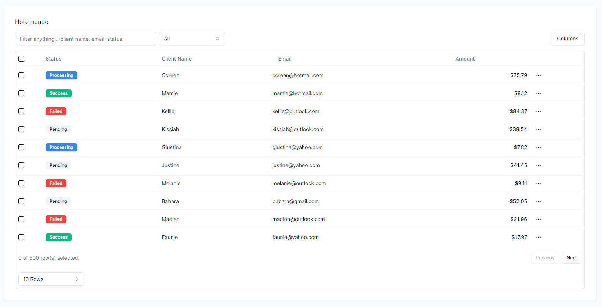

# shadcn/UI


## Sobre este repositorio

Este es el repositorio con las prácticas creadas en el curso de devtalles [shadcn](https://cursos.devtalles.com/courses/take/shadcn-ui) que se puede encontrar en [devtalles](https://cursos.devtalles.com/).  

[Repositorio del curso](https://github.com/DevTalles-corp/shadcn-dashboard)

## Getting Started

First, run the development server:

```bash
npm run dev
# or
yarn dev
# or
pnpm dev
# or
bun dev
```

Open [http://localhost:3000](http://localhost:3000) with your browser to see the result.

You can start editing the page by modifying `app/page.tsx`. The page auto-updates as you edit the file.

This project uses [`next/font`](https://nextjs.org/docs/basic-features/font-optimization) to automatically optimize and load Inter, a custom Google Font.

# Apuntes

This is a [Next.js](https://nextjs.org/) project bootstrapped with [`create-next-app`](https://github.com/vercel/next.js/tree/canary/packages/create-next-app).
Cuando trabajamos con Next, el sistema de rutas esta basado en el sistema de directorios. Esto es, si en el filesystem tenemos:

<pre>
mi_proyecto  
├── src  
    ├── app  
        ├── dashboard  
            ├── layout.tsx  
            ├── home  
                ├── page.tsx  
</pre>

Esto mapeará con un https://urlbase/dashboard/home/

Y se mostraría lo que se encuentre en el page.tsx

## Instalar componentes

```bash
npx shadcn-ui@latest add 
```

Mostrará una lista de componentes que podemos instalar.

## Otros paquetes necesarios

### Unique name generator

Permite crear nombres de forma automatica y aleatoria

```bash
npm i unique-names-generator uuid
```

### UUID generator

Permite crear UUID de forma automatica

```bash
npm i uuid
npm i --save-dev @types/uuid
```

### Autoplay

Permite que el carrusel se mueva de forma automatica

```bash
npm install embla-carousel-autoplay --save
```

## Tablas

### Tanstack



```bash
npm install @tanstack/react-table
```

#### Features

- Paginación
- Ordenación
- Filtros
- Columnas visibles
- Selección multiple

## Formularios
